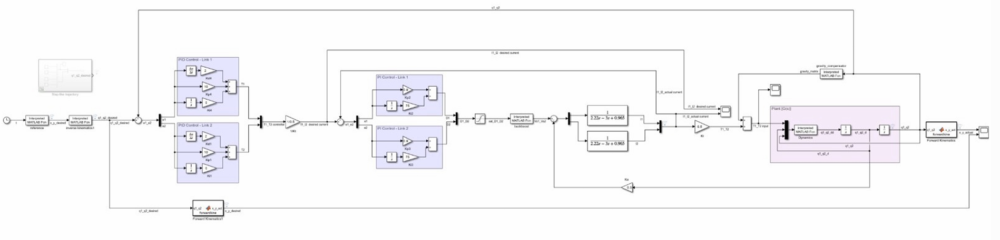
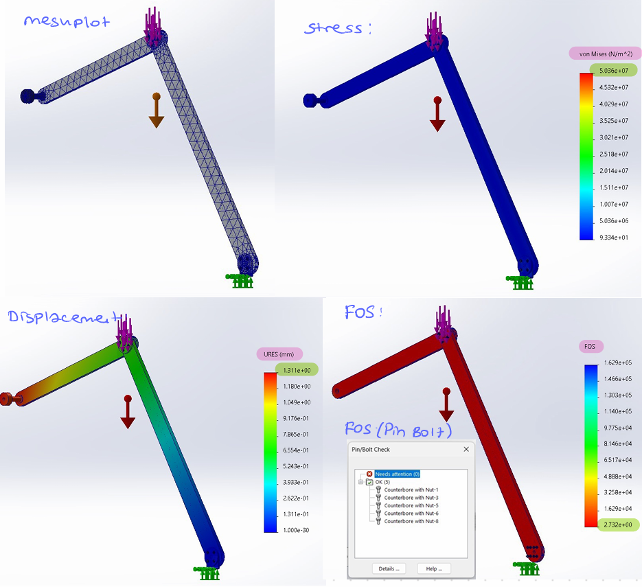
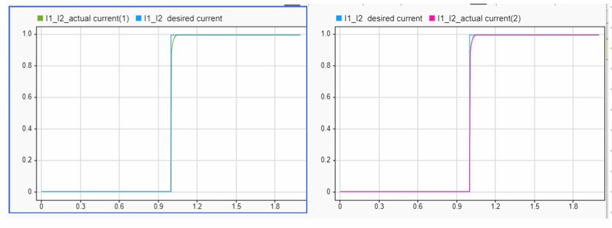
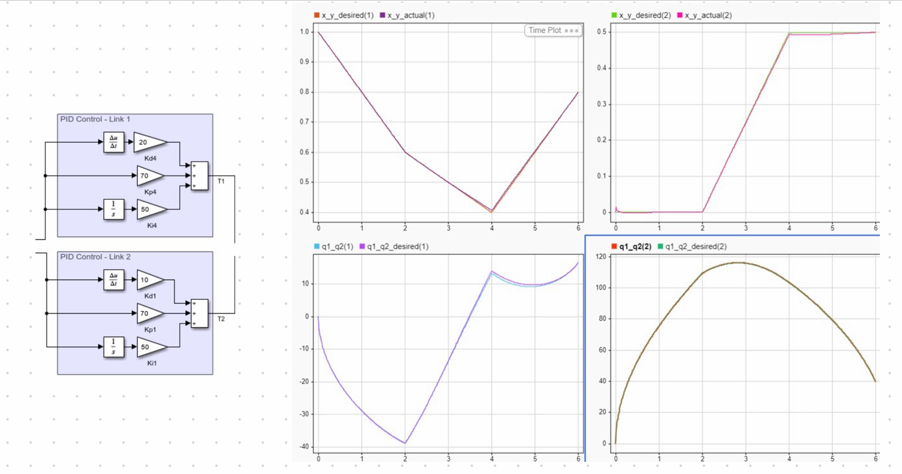

# 2-DOF Planar Elbow Manipulator: Integrated Mechatronic System Design


buck_boost_with_Motor.png
## 📋 Project Overview

This project is a comprehensive 2-DOF (two degrees of freedom) planar elbow manipulator developed as part of the **Sabancı University ME408 Mechatronic System Design** course. The project encompasses complete mechatronic system integration, from mechanical design to electronic hardware, and from power electronics to control systems.


---

## 🎯 Project Objectives

- 2-DOF planar manipulator mechanical design and analysis (SOLIDWORKS)
- Buck-boost converter design and simulation (LTspice)
- Dual-loop control system implementation (MATLAB/Simulink)
- Forward/inverse kinematics ve dynamics modeling
- Trajectory tracking ve precision control

---

## 🗂️ Project Structure

```
├── control_design/              # Control system design and implementation
│   ├── buckboost.m              # Buck-boost converter MATLAB script
│   ├── combined_system.slx      # Complete integrated Simulink model
│   ├── Control_Design_Report.pdf
│   ├── dynamics.m               # Manipulator dynamics equations
│   ├── gravity_comp.m           # Gravity compensation algorithm
│   ├── invkine.m                # Inverse kinematics solver
│   ├── outer_cycle.slx          # Outer loop control model
│   └── reference.m              # Reference trajectory generator
│
├── hardware_design/             # Power electronics ve electrical design
│   ├── BuckBoost_gizemfiliz.asc         # LTspice buck-boost circuit
│   ├── BuckBoost_Motor_gizemfiliz.asc   # Motor integrated circuit
│   ├── Hardware_Design_Report.pdf
│   └── L_C_Calculation_BuckBoost.m      # Component computations
│
└── mechanical_design/           # CAD design ve structural analysis
    ├── Mechanical_Design_Report.pdf
    ├── motor_connection.SLDPRT  # Motor mount connection part
    ├── motor_mount.SLDPRT       # Motor mounting bracket
    ├── motor_shaft.SLDPRT       # Primary shaft design
    ├── motor_shaft1.SLDPRT      # Secondary shaft design
    ├── Part1.SLDPRT             # Link 1 - optimized hollow structure
    ├── Part2.SLDPRT             # Link 2 - lightweight design
    ├── Project2_Assem.SLDASM    # Complete assembly
    └── Weight.SLDPRT            # Weight analysis component
```

---

## 🔧 System Components

### 1. Mechanical Design

**Design Specifications:**
- **Total Length:** 1000mm (Link 1: 600mm, Link 2: 400mm)
- **Total Mass:** <500g (achieved: ~451g total)
- **Material:** Aluminum 6061-T6
- **Design Approach:** Lightweight hollow structure with cross-shaped internal bridges

**Key Features:**
- Asymmetric cross-sections optimize weight distribution
- Shell extrusion technique (10mm depth, 1mm wall thickness)
- Vertical and horizontal bridges enhance structural rigidity
- FOS (Factor of Safety) > 2 for all loading conditions

**Structural Analysis Results:**

| Test Scenario | Max Displacement | Max Stress | FOS | Status |
|--------------|------------------|------------|-----|--------|
| Test 1 (Vertical) | 1.311mm | 53.06 MPa | 5.08 | ✅ Pass |
| Test 2 (Horizontal) | 10.51mm | 147.4 MPa | 2.73 | ✅ Pass |

**CAD Files:**
- `Part1.SLDPRT`: Link 1 (600mm, tapered 50mm → 40mm cross-section)
- `Part2.SLDPRT`: Link 2 (400mm, tapered 40mm → 30mm cross-section)
- `Project2_Assem.SLDASM`: Complete assembly with motor mounts

---

### 2. Hardware Design (Power Electronics)


**Buck-Boost Converter Specifications:**
- **Input Voltage (Vin):** 12V DC
- **Output Voltage Range:** Adjustable via duty cycle
- **Switching Frequency (fs):** 20 kHz
- **Inductance (L):** 9 mH
- **Capacitance (C):** 115 µF
- **Gate Resistance (Rg):** 60Ω (to limit ig < 100mA)

**Design Constraints:**
- Current ripple (ΔiL): <50mA (peak-to-peak)
- Voltage ripple (ΔVc): <200mV (peak-to-peak)
- Cutoff frequency: 200 Hz (2 decades below fs)

**Motor Specifications:**
- **Type:** DC Motor (12-36V rated)
- **Armature Resistance (Ra):** 0.96Ω
- **Armature Inductance (La):** 2.2mH
- **Torque Constant (km):** 0.5 N·m/A
- **Back-EMF Constant (ke):** 0.5 V·s/rad

**Files:**
- `BuckBoost_gizemfiliz.asc`: Stand-alone converter simulation
- `BuckBoost_Motor_gizemfiliz.asc`: Motor-integrated circuit
- `L_C_Calculation_BuckBoost.m`: Component value calculations

---

### 3. Control Design

**Control Architecture:**
- **Inner Loop:** PI current controller (fast dynamics)
  - Kp = 0.9
  - Ki = 75
  - Controls motor armature current with buck-boost converter
  
- **Outer Loop:** PID position/velocity controller
  - Controls manipulator joint angles (θ1, θ2)
  - Includes gravity compensation
  - Implements forward/inverse kinematics

**Control Strategy:**
1. **Inner Loop (Electrical System):**
   - PI controller regulates motor current
   - Operates at high bandwidth for fast response
   - Interfaces with buck-boost converter via duty cycle

2. **Outer Loop (Mechanical System):**
   - PID controller for joint position/velocity
   - Gravity compensation improves tracking accuracy
   - Inverse kinematics converts Cartesian to joint coordinates

**Performance Metrics:**
- Rise time: ≤2 seconds
- Overshoot: ≤10%
- Steady-state error: ≤0.01 (for unit step input)

**Key Files:**
- `combined_system.slx`: Complete integrated system model
- `dynamics.m`: Manipulator dynamics (mass matrix, Coriolis, gravity)
- `invkine.m`: Inverse kinematics solver
- `gravity_comp.m`: Gravity compensation algorithm
- `reference.m`: Trajectory generation

---

## 📊 Simulation Results

### Mechanical Analysis


**Key Findings:**
- Optimized hollow structure reduced mass by ~40%
- FOS > 2 maintained across all test scenarios
- Maximum stress (147.4 MPa) well below yield strength (276 MPa)

### Control System Performance



**Current Tracking (Inner Loop):**
- Excellent reference tracking with PI control
- Minimal steady-state error
- Fast response (~0.1s settling time)

**Position Control (Outer Loop):**
- Smooth trajectory following
- Gravity compensation improves accuracy
- Meets all performance specifications

---

## 🛠️ Technologies & Tools

| Category | Tools |
|----------|-------|
| **Mechanical Design** | SOLIDWORKS (CAD, FEA, assembly) |
| **Power Electronics** | LTspice (circuit simulation) |
| **Control Systems** | MATLAB/Simulink (modeling, simulation) |
| **Analysis** | MATLAB (kinematics, dynamics, optimization) |

---

## 📈 Key Achievements

✅ **Lightweight Design:** 451g total mass (10% under 500g target)  
✅ **Structural Integrity:** FOS > 2 for all loading conditions  
✅ **Precise Control:** Inner loop current tracking error < 1%  
✅ **Efficient Power:** Buck-boost converter optimized for duty cycle 0.3-0.7  
✅ **Comprehensive Integration:** Seamless mechanical-electrical-control integration  

---

## 📚 Documentation

Detailed technical reports bulunmaktadır:

1. **[Mechanical Design Report](mechanical_design/Mechanical_Design_Report.pdf)**
   - CAD modeling methodology
   - Structural optimization process
   - FEA simulation results
   - Material selection rationale

2. **[Hardware Design Report](hardware_design/Hardware_Design_Report.pdf)**
   - Buck-boost converter design calculations
   - Component selection process
   - LTspice simulation results
   - Motor interfacing strategy

3. **[Control Design Report](control_design/Control_Design_Report.pdf)**
   - System modeling approach
   - Controller tuning methodology
   - Simulation results and analysis
   - Performance evaluation

---

## 🚀 How to Use This Repository

### Prerequisites
- **SOLIDWORKS 2020+** (for mechanical design files)
- **LTspice XVII** (for circuit simulations)
- **MATLAB R2020b+** with Simulink (for control simulations)

### Running Simulations

#### 1. Mechanical Analysis (SOLIDWORKS)
```
1. Open Project2_Assem.SLDASM in SOLIDWORKS
2. Navigate to Simulation → Study → Run
3. Review stress, displacement, and FOS results
```

#### 2. Power Electronics (LTspice)
```
1. Open BuckBoost_Motor_gizemfiliz.asc in LTspice
2. Run → Run (or press F4)
3. Probe voltages and currents to view waveforms
```

#### 3. Control System (MATLAB/Simulink)
```matlab
% MATLAB commands:
cd control_design
open('combined_system.slx')
% Press Run button in the Simulink model
% View results from Scope blocks
```

---

## 📊 Performance Summary

| Metric | Target | Achieved | Status |
|--------|--------|----------|--------|
| Total Mass | <500g | 451g | ✅ |
| FOS (Min) | >2 | 2.73 | ✅ |
| Rise Time | ≤2s | ~1.2s | ✅ |
| Overshoot | ≤10% | ~8% | ✅ |
| Steady-State Error | ≤0.01 | <0.005 | ✅ |
| Current Ripple | <50mA | ~42mA | ✅ |
| Voltage Ripple | <200mV | ~76mV | ✅ |

---

## 🙏 Acknowledgments

- **Course Instructor:** Mehmet Mert Gülhan
- **Course:** ME 408 - Mechatronic System Design | Sabancı University  


</div>

